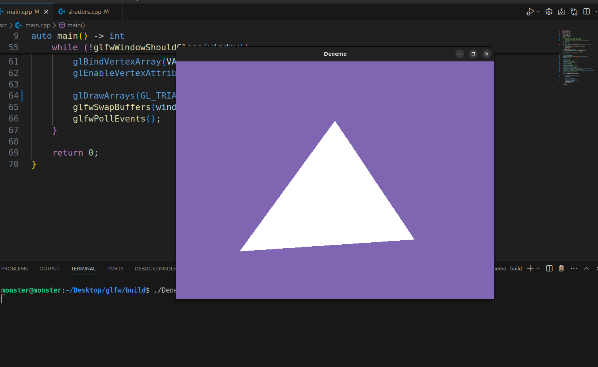

### install libs on the ubuntu:
```
sudo apt install libwayland-dev
sudo apt install libxkbcommon-dev
sudo apt install libx11-dev
sudo apt install pkg-config
sudo apt install libxrandr-dev
sudo apt install libxinerama-dev
sudo apt install libxcursor-dev
sudo apt install libxi-dev

```
---
### First image (Draw)


---